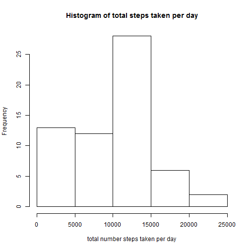

# Reproducible Research: Peer Assessment 1

## Loading and preprocessing the data
* Dependent on following packages
    
    ```r
    library(data.table)
    library(lattice)
    ```

* Read into R-Environment as "raw" data
    
    ```r
    data.raw <- read.csv("activity.csv")
    ```


## What is mean total number of steps taken per day?

1. Make a histogram of the total number of steps taken each day
    
    
    ```r
    # the total number of steps taken each day (ingoring the NA records)
    stepsPerDay <- data.table(data.raw)[, lapply(.SD, sum, na.rm = TRUE), by = date]
    hist(stepsPerDay$steps, xlab = "total number steps taken per day", main = "Histogram of total steps taken per day")
    ```
    
     


2. Calculate and report the **mean** and **median** total number of steps taken per day 

    
    ```r
    # The mean total number of steps taken per day
    mean(stepsPerDay$steps)
    ```
    
    ```
    ## [1] 9354
    ```
    
    ```r
    # The median total number of steps taken per day
    median(stepsPerDay$steps)
    ```
    
    ```
    ## [1] 10395
    ```


## What is the average daily activity pattern?
1. Time series plot of the 5-minute interval and the average number of steps taken, averaged across all days

    
    ```r
    # the total number of steps taken each day (ingoring the NA records)
    
    stepsPerInterval <- data.table(data.raw)[, lapply(.SD, mean, na.rm = TRUE), 
        by = interval]
    xyplot(steps ~ interval, data = stepsPerInterval, type = "l", xlab = "Identified intervals", 
        ylab = "Averaged number steps across all days")
    ```
    
     


2. Which 5-minute interval, on average across all the days in the dataset, contains the maximum number of steps?
    
    ```r
    # find the interval in which the maximum number steps were taken
    stepsPerInterval[which.max(stepsPerInterval$steps), ]$interval
    ```
    
    ```
    ## [1] 835
    ```


## Imputing missing values
1. Calculate and report the total number of missing values in the dataset (i.e. the total number of rows with NAs)
    
    ```r
    sum(is.na(data.raw$steps))
    ```
    
    ```
    ## [1] 2304
    ```


2. Devise a strategy for filling in all of the missing values in the dataset. The strategy does not need to be sophisticated. For example, you could use the mean/median for that day, or the mean for that 5-minute interval, etc.
    * I am going to replace the missing value with "the mean for that 5-minute interval across all days", because of the **similarity** in daily activities.
    
3. Create a new dataset that is equal to the original dataset but with the missing data filled in.
    
    ```r
    data.filled <- data.raw  # Init a new dataset with copy of the original data
    for (i in 1:nrow(data.raw)) {
        # find the missing value
        if (is.na(data.raw[i, ]$steps)) {
            # look up the mean value and insert
            mean_steps <- stepsPerInterval[interval == data.raw[i, ]$interval, ]$steps
            data.filled[i, ]$steps <- mean_steps
        }
    }
    ```

    
4. Make a histogram of the total number of steps taken each day and Calculate and report the mean and median total number of steps taken per day. Do these values differ from the estimates from the first part of the assignment? What is the impact of imputing missing data on the estimates of the total daily number of steps?

    
    ```r
    # update the average with filled values
    stepsPerDay2 <- data.table(data.filled)[, lapply(.SD, sum), by = date]
    ```

    
    ```r
    # The mean total number of steps taken per day after imputing
    mean(stepsPerDay2$steps)
    ```
    
    ```
    ## [1] 10766
    ```
    
    ```r
    # The median total number of steps taken per day after imputing
    median(stepsPerDay2$steps)
    ```
    
    ```
    ## [1] 10766
    ```

    
    Answer: The imputed data has changed the mean value and the median value of total steps taken per day. 

## Are there differences in activity patterns between weekdays and weekends?

1. Create a new factor variable in the dataset with two levels - "weekday" and "weekend" indicating whether a given date is a weekday or weekend day.
    
    ```r
    # in POSIXlt, field 'wday' has value 0-6, starting on Sunday
    data.filled$day = ifelse(as.POSIXlt(as.Date(data.filled$date))$wday%%6 == 0, 
        "weekend", "weekday")
    # For Sunday and Saturday : weekend, Other days : weekday
    data.filled$day = factor(data.filled$day, levels = c("weekday", "weekend"))
    ```


2. Make a panel plot containing a time series plot (i.e. type = "l") of the 5-minute interval (x-axis) and the average number of steps taken, averaged across all weekday days or weekend days (y-axis). The plot should look something like the following, which was creating using simulated data:
    
    ```r
    stepsPerInterval2 = data.table(data.filled)[, lapply(.SD, mean), by = list(interval, 
        day)]
    xyplot(steps ~ interval | day, data = stepsPerInterval2, aspect = 1/2, type = "l")
    ```
    
     

    
    There is obviously difference between weekends and weekdays
